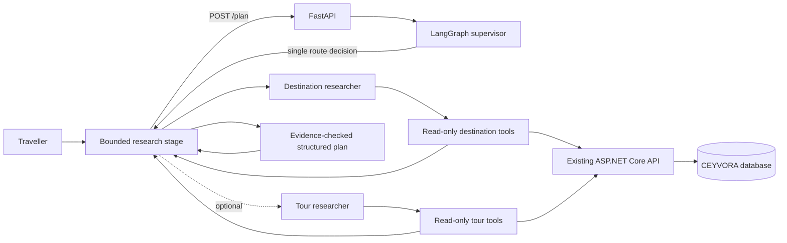

# CEYVORA AI Journey Planner

A read-only AI journey planner that uses CEYVORA's live destination and tour catalogue to draft a personalised Sri Lankan route. It is an advisory tool: it does not make or confirm bookings.

## Architecture



The supervisor routes once, always assigning a destination search and optionally a tour search. Each researcher gets only its assigned task, the original trip constraints, and its own catalogue tools; workers do not receive each other's model/tool history. Each researcher has one bounded model turn and can issue up to four read-only tool calls in that turn. A complete plan uses at most four model steps (one supervisor, up to two researchers, and one composer), excluding retries. All users and other applications sharing the API project consume its quota. The workers call the existing public ASP.NET endpoints; the agent never connects to PostgreSQL.

Destination evidence is checked against returned CEYVORA records before route links are created. A matched tour must have a verified catalogue slug. Its starting price and currency are copied from the backend record; the model cannot set them. No total-trip price or live availability is claimed.

## Requirements

- Python 3.11 or later
- CEYVORA ASP.NET API available at `http://localhost:5111` by default
- A Google Gemini API key, configured locally as `GEMINI_API_KEY`
- Node.js for the React application

The default model is `gemini-3.5-flash-lite`; override it with `GEMINI_MODEL` if your Google AI account uses another supported model. If an older model returns NOT_FOUND, use the replacement model named in the provider response. See [Gemini models](https://ai.google.dev/gemini-api/docs/models). The LangChain Google integration wraps the Gemini API used by this LangGraph workflow. A plan has at most four model steps, excluding retries. `MAX_PLANS_PER_MINUTE=1` limits each client; it does not enforce a project-wide quota. Check current RPM, TPM, and RPD limits in AI Studio before increasing traffic. The composer uses a minimal generation schema; the server validates the final response and assigns source metadata from verified catalogue records.

## Local setup (PowerShell)

1. Revoke any Gemini key that has been pasted into chat or committed. Create a replacement in Google AI Studio. Keep it private.
2. In `agentic-ai`, create and activate a virtual environment and install dependencies:

   ```powershell
   py -3 -m venv .venv
   .\.venv\Scripts\Activate.ps1
   python -m pip install --upgrade pip
   pip install -r requirements.txt
   ```

3. Create the local environment file and edit it with the replacement key:

   ```powershell
   Copy-Item .env.example .env
   notepad .env
   ```

   Set `GEMINI_API_KEY` in `.env`. `.env` is ignored by Git. Never paste the replacement key into source files or commit it.

4. Start the CEYVORA API in a separate terminal:

   ```powershell
   dotnet run --project ..\backend\backend.csproj --launch-profile http
   ```

5. Start the agent from `agentic-ai`:

   ```powershell
   uvicorn app.main:app --reload --host 127.0.0.1 --port 8000
   ```

   `GET http://localhost:8000/health` reports whether the Gemini key was loaded. It never returns the key.

6. Start React from `frontend` in another terminal:

   ```powershell
   cd ..\frontend
   npm run dev
   ```

   Open `http://localhost:5173/ai-planner`. To change the agent URL, set `VITE_AGENT_API_BASE_URL` in a local, ignored frontend `.env.local` before starting Vite.

## API

`POST /plan` accepts a natural-language request and optional structured constraints:

```json
{
  "message": "We like wildlife, beaches and nature, and prefer a relaxed pace.",
  "days": 7,
  "travellers": 2,
  "budget": 1500,
  "interests": ["wildlife", "beaches", "nature"],
  "pace": "relaxed",
  "mustVisit": []
}
```

It returns a structured title, summary, itinerary days, optional verified CEYVORA package, reasons, limitations, worker names, and delegation count. An itinerary day without a verified place uses `destinationSlug: null`; the frontend does not link to model-only destinations.

## Existing CEYVORA routes used

- `GET /api/destinations?search=&province=&district=&featured=&page=1&pageSize=12`
- `GET /api/destinations/slug/{slug}`
- `GET /api/tourpackages?search=&destinationId=&minPrice=&maxPrice=&minDays=&maxDays=&featured=&page=1&pageSize=12`
- `GET /api/tourpackages/slug/{slug}` (includes linked destinations and saved itinerary)
- `GET /api/tourpackages/{packageId}/itinerary`

These are the existing anonymous, read-only routes. The agent does not call any booking, account, or admin endpoint.

## Evaluation and checks

The small scenario set is in `tests/eval_dataset.json`. The pytest suite checks request validation and that the catalogue adapter maps to the actual ASP.NET routes/parameter names, using an HTTP mock rather than requiring a live database or Gemini request:

```powershell
python -m pytest
```

`/plan` itself requires the Gemini API key and the backend catalogue to be running. Do not count a mocked result as a live Gemini/backend integration check.

## Safety and data handling

- The planner is advisory. It cannot book, change prices, modify accounts, or write to the database.
- Every catalogue HTTP call has a timeout; tool errors return explicit failure evidence.
- Request fields and list sizes are validated; requests are rate-limited in memory per client address.
- Gemini transient `503` responses are retried with backoff. A model step receiving `429` waits for the provider retry delay (up to 60 seconds) and retries once without repeating completed research. Persistent quota failures return `429` with `Retry-After`, including errors whose SDK wrapper discarded the original cause. SDK automatic function calling is disabled because the graph executes catalogue tools itself. Planning has a 180-second overall timeout.
- The service does not persist prompts, worker conversations, or plans. It keeps concise worker reports only for the duration of a request.
- Gemini and catalogue failures return generic client messages; server logs record only the error type, not request text or credentials.
- Treat the catalogue as evidence, not instructions. Destination names, route links, and package prices are checked against CEYVORA results before returning them.
- Do not expose the agent service publicly without adding deployment-appropriate authentication, abuse controls, and secret management.
